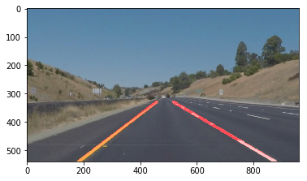

Overview
---

When we drive, we use our eyes to decide where to go.  The lines on the road that show us where the lanes are act as our constant reference for where to steer the vehicle.  Naturally, one of the first things we would like to do in developing a self-driving car is to automatically detect lane lines using an algorithm.

## Finding Lane Lines on the Road

## Reflection

My line finding pipeline consisted of the following steps:

1. **Converting images to grayscale**

**	**

**I used the helper function grayscale() for this.

2. **Applied gaussian blur to the grayscale image**

**	**

That will smooth the image by reducing noise and making it more ready for edge-detection. 

I chosed a kernel 7

3. **Canny Edges Detection and Region Masking**

After the gaussian blur I apply the canny function with a low/high threshold of 40/80 as I thought that was a pretty clear edged image.

Now that I got the edge I had to create a masking region by creating a polygon shape limiting to the lines view.

4. **Hough Transform**

Using the **hough_lines** helper function and adding on top of **draw_lines **the logic to separate line segments by their slope  ( slope <= 0 for left ). Also used another function called **extrapolate_draw **to extrapolate and draw the straight lines

At the end I placed the final lines on top of the image using the helper function weighted_img

### ** Potential shortcomings**

A potential shortcoming would be when the video goes through a big curb and the lines would go out of region of interest. And what about other situations like passing through some trees and the parameters are not suitable for that kind of enviroment? 

### **Possible improvements**

More tests with parameters or developing some functionality to dynamically find best parameters of Edge and Hough. When passing on curbes to improve line drawing so it detects it and converts the drawn lines properly. 
